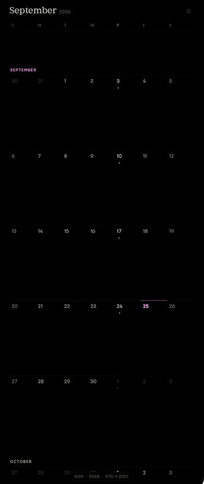
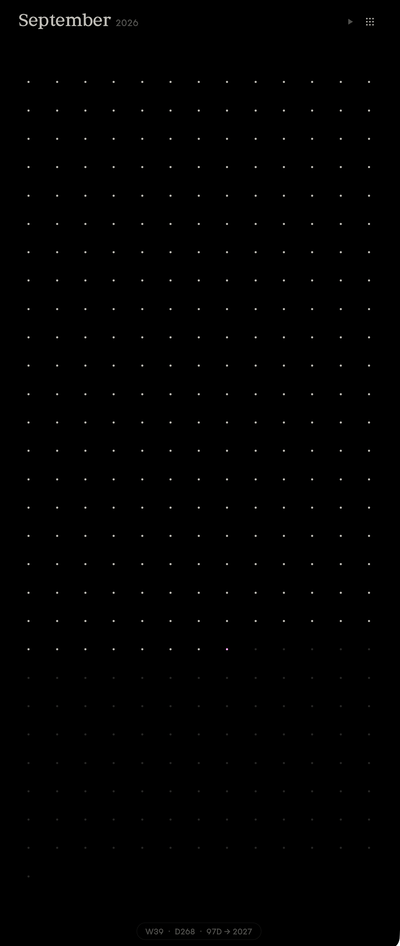

# Tufa Calendar

A dead simple calendar for the Obsidian sidebar. It shows the date, and that's the only thing it does. It never creates or changes a note.

<p>
  
  
</p>

## What you see

There are two views. The grid button in the top corner switches between them.

The month view scrolls through the months. Today is highlighted in your accent color and Thursdays have a small dot. Click a day to copy its date, like "September 18th, 2026". If you leave it on another month for 20 seconds, it scrolls back to today.

The year view has one dot for each day of the year. Past days are bright and today uses your theme's accent color. The play button sends slow ripples across the dots.

At the bottom, a small counter shows the week, the day of the year and the days left in the year, like `W39 · D268 · 97D → 2027`. The calendar fills whatever pane you put it in.

## Install

Copy `manifest.json`, `main.js` and `styles.css` into `<vault>/.obsidian/plugins/tufa-calendar/`. Then turn on Tufa Calendar in Settings → Community plugins.

## Customize

Everything comes from your Obsidian theme, so it matches out of the box. To change something, set one of these variables:

| Variable | What it changes | Default |
|---|---|---|
| `--tufa-accent` | Today, the current month and the play button | `--interactive-accent` |
| `--tufa-ink` | The month header and month labels | `--tufa-text` |
| `--tufa-text` | Day numbers and dots. Weekends, other months and past dots are faded versions of it. | `--text-normal` |
| `--tufa-font` | The month header font | `--font-text` |

If you use the Style Settings plugin, these show up under Settings → Style Settings → Tufa Calendar. Anything you leave alone keeps your theme's value.

Without Style Settings, put them in a CSS snippet (Settings → Appearance → CSS snippets) and set only the ones you want:

```css
body {
  --tufa-accent: #ffadf6;
  --tufa-ink: #bfbdb6;
  --tufa-font: "Georgia";
}
```
